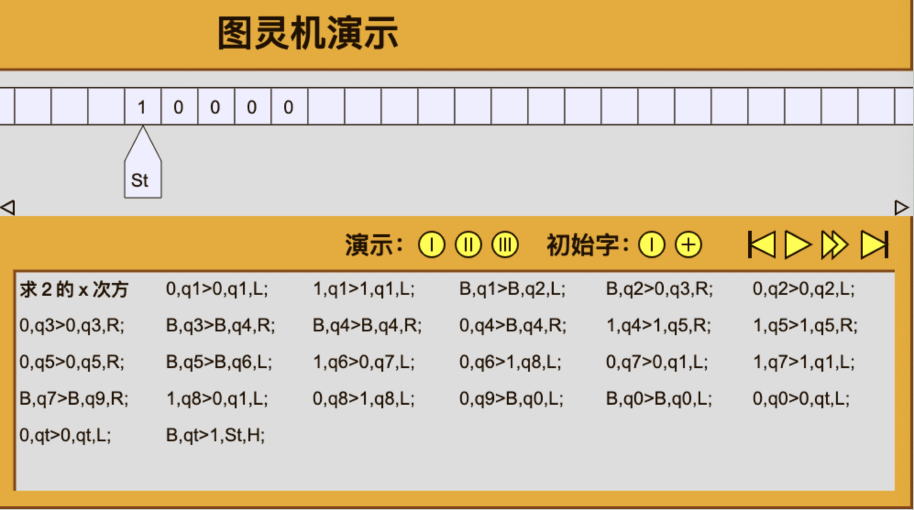

# 图灵机

> **[图灵机](../.gitbook/assets/turing.html)**（英语：Turing machine），又称**确定型图灵机**，是英国数学家艾伦·图灵于1936年提出的一种抽象计算模型，其更抽象的意义为一种数学逻辑机，可以看作等价于任何有限逻辑数学过程的终极强大逻辑机器。
>
> 图灵机的本质是一个有序的七元组，其在现实世界的一个类似模拟是能够读取纸带信息的移动盒子所组成的系统。

