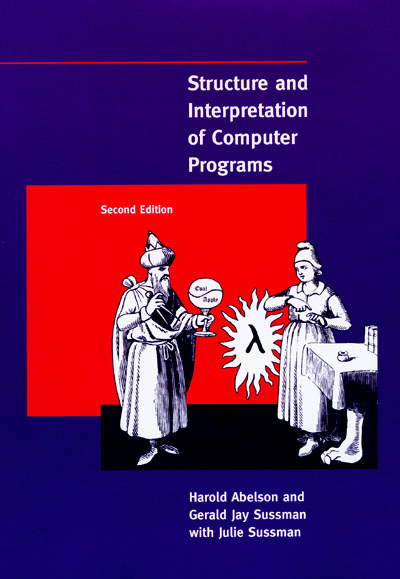

# 从佩亚诺公理到 λ -演算

### 关于《SCIP》这本书

> 《Structure and Interpretation of Computer Programs》\(《计算机程序的构造与解释》\) 是一本曾被用作计算机学科导论教育的教科书。
>
> * 目录
>   1. 构造过程抽象
>   2. 构造数据抽象
>   3. 模块化、对象和状态
>   4. 元语言抽象
>   5. 寄存器机器里的计算

